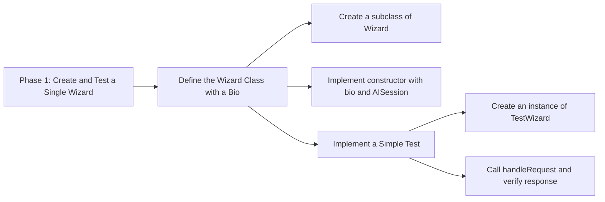
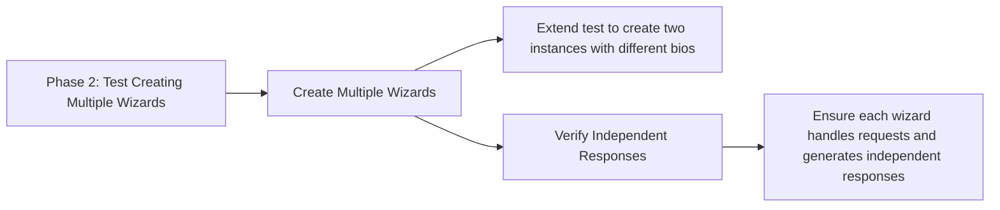
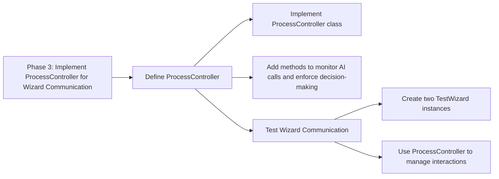
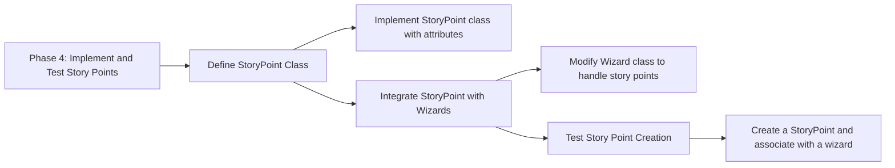
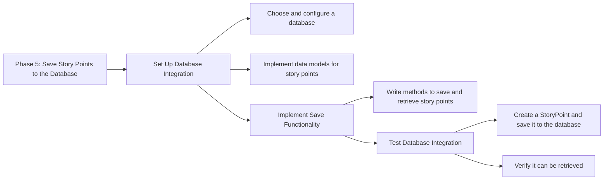
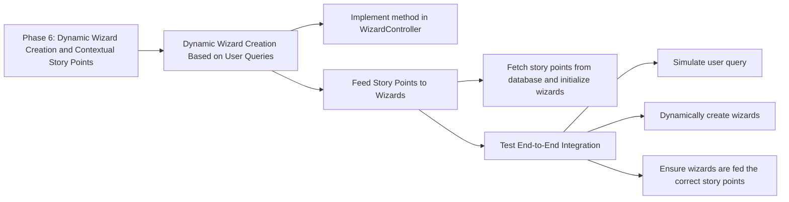
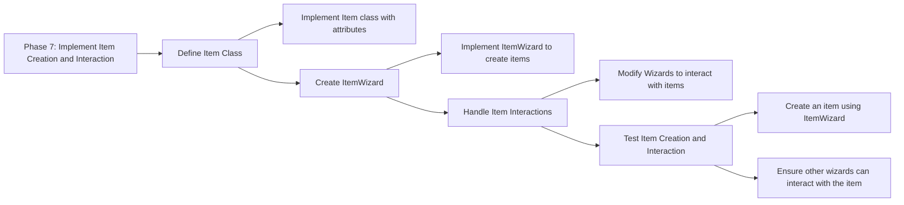

# Work Plan Flow Chart

## Phase 1: Create and Test a Single Wizard

## Phase 2: Create and Test Multiple Wizards

## Phase 3: Implement ProcessController for Wizard Communication

## Phase 4: Implement and Test Story Points

## Phase 5: Save Story Points to the Database

## phase 6: Dynamic Wizard Creation and Contextual Story Points

## Phase 7: Implement Item Creation and Interaction

