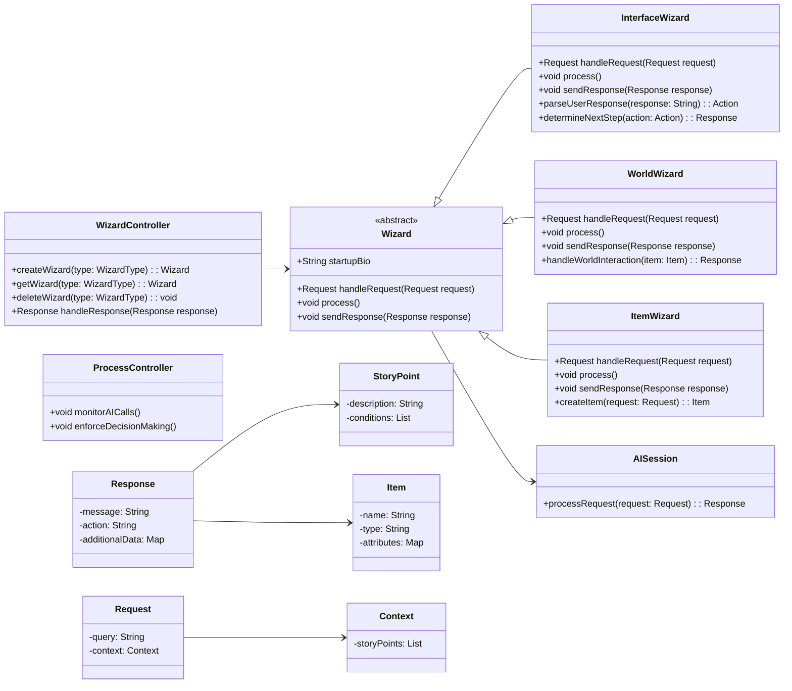

# Class Structure Documentation

## Overview

This document describes the class structure for StoryBlender, which utilizes various AI sessions that I will refer to as wizards because that's what they are. Also, I think it's more fun to conceptualize them this way. Each wizard controls a different part of the program. The wizards are managed by a `WizardController`.

## Class Diagram

