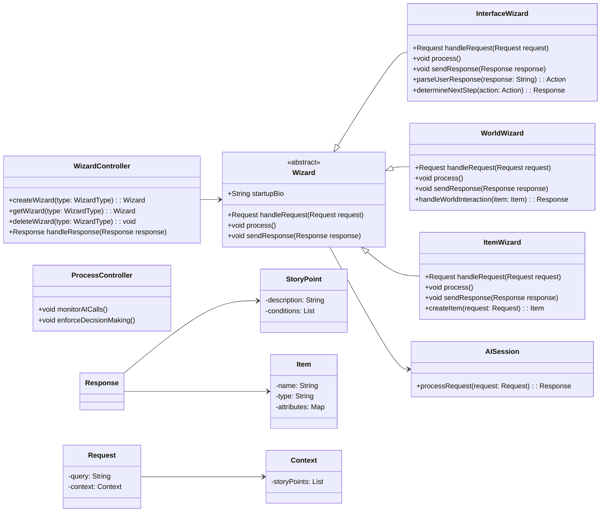

# Class Structure Documentation

## Overview

# Overview

This document provides an in-depth description of the class structure for StoryBlender, a system that leverages various AI sessions, referred to as wizards, to manage different aspects of the program. Each wizard is responsible for handling a specific part of the application. The overall management and coordination of these wizards are handled by the `WizardController`. Additionally, a `ProcessController` ensures that the system does not get stuck in infinite loops of AI interactions.

## Class Structure

### WizardController

The `WizardController` is the central class responsible for managing the lifecycle of wizards. It can create, retrieve, and delete wizards. It also determines the most appropriate wizard to handle a given response.

### ProcessController

The `ProcessController` oversees the interactions between wizards to prevent infinite loops. It monitors the number of calls and responses between AIs and enforces decision-making after a predefined number of interactions.

### Wizard (Abstract Class)

The `Wizard` class serves as the base class for all specific wizards. It defines the common methods that all wizards must implement, including handling requests, processing actions, and sending responses. Each wizard also has a `startupBio` that is initialized every time it is created.

### InterfaceWizard

The `InterfaceWizard` handles user interactions. It processes user inputs, determines the appropriate actions, and sends responses based on those actions.

### WorldWizard

The `WorldWizard` manages interactions with world items, such as places and tools. It processes world-related requests and handles interactions with these items.

### ItemWizard

The `ItemWizard` is responsible for creating items. It handles item creation requests and generates items based on the given requests.

### AISession

The `AISession` represents an AI session that wizards interact with to process requests. It processes requests and returns responses.

### Request

The `Request` class encapsulates the user's query and context information. The context can include detailed JSON structures with information relevant to the request, such as the story points.

### Response

The `Response` class contains the result of handling a request. It includes a message, any story points created, and a list of items generated as a result of the request.

### StoryPoint

The `StoryPoint` class represents potential events that can result in the creation of an item or the meeting of new characters. For any item to be created, there must be a corresponding story point.

### Item

The `Item` class represents abstract elements within a story, such as characters, places, locations, or tools like a sword.

### Context

The `Context` class stores all relevant information about the request, including the story points associated with it.

## Example Data Structures

### Request Example

  "query": "Can you create me a sword?",
  "context": {
    "storyPoints": ["StoryPoint1", "StoryPoint2"]
  }

## Class Diagram

